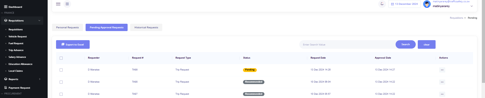

These are the Scenarios where one of the approvers is not available and they have assigned someone to approve for them. This out of office case could be because of vacation, illness or any other reason that may result in the approver failing to approve requests. When the one set as alternate approver is in the approval flow procees, they also have to allocate their approval role to someone who will also take over whilst they are approving for the absent approver. When the approver is back in office, they simply log in and reclaim their role by simply setting their status as available.

---

## Scenario: User crafts a trip advance request when Finance Manager is on leave and the Accounts Clerk is approving for the Finance Manager

This type of reuest encompasses these steps:
- **STEP 1**: Finance Manager sets Accounts Clerk as alternate approver
- **STEP 2**: User makes a trip advance request
- **STEP 3**: Accounts Clerk approves as Finance Manager
- **STEP 4**: Director of Finance recommends the request to MD
- **STEP 5**: MD approves the trip advance request
- **STEP 6**: User cheks their request's status

### STEP 1 - Finance Manager sets Accounts Clerk as alternate approver
Sadzauchi logs in to his account and visits his profile section as shown below:

User visits the Approvals section. From this section, user will be in a position to see that they are currently set as available. To set someone as an alternate approver, user clicks on the edit icon and they will be able to see an option to choose the approver from the employees' list.

After choosing the alternate approver, user clicks save from above and they will have the image below devised to them.

Now that an alternate approver is set, user's requests that should go to Sadzauchi's profile for approval will now be going to Matinyarare's account.

### STEP 2 – User makes a trip advance request

From above, user inputs the type of request thus trip advance. This is followed by the distance of the trip. Distance can be a one trip or  a rounded one, and if its a rounded trip user simply ticks on rounded trip to have both distances captured.
There is also a section where user gets to put additional distances id any given there will be extra kilometres that are going to be incurred when undertaking the trip advance. If added the additional distance will be summated with the trip distance when total distances are being calculated.
To have the trip expenses page below user clicks next after the distance, trip dates and the reason for the trip. This stage also includes the process of choosing a vehicle or not. User may be using air as their mode of transport, in that case there won't be any need of selecting yes on **requires a vehicle** option.
When user shoots for a vehicle, they will then be required to fill in the details of both fuel and vehicle requests which are not going to be demonstrated on this scenario.

Trip expenses are already set in accord to the standards the organisation operates by. However, if user want to add any other expenses that are not set, they simply click the plus sign to add additional expenses.
After completing this sheet, user clicks save and will have their request shown under personal requests with a pending status.

The pendiing status here means that the request is now going through the approval flow process. In this case, it has gone to Matinyarare instead of Sadzauchi since Matinyarare is approving for Sadzauchi hence alternate approver.

#### STEP 3 - Accounts Clerk approves as Finance Manager
For Matinyarare to approve this, they simply visit their pendiing approval requests. The image below shows Matinyarare's pending approvals.

To approve this, user clicks on actions of this trip advance request. By so doing, they will have an option to 
- **Approve** ,
- **Hold** or
- **Reject**  the request as shown below.

User clicks on the Approve button and this action recommends this request to the Director of Finance, Gobo.

#### STEP 4 - Director of Finance recommends the request to MD
To see recommended requests, Finance Director logs in to check pending approvals. This will be shown as depicted here:

The approver simply cicks on actions to have the image below for necessarry actions.

The approve action recommends the request to Munodawafa, the final approver.

#### STEP 5 - MD approves the trip advance request
To see the recommended request, the MD simply checks their pending approvals as shown below.

The MD approves this requests as the final approver. After approving a request, the status will change from recommended to approved as will be shown by **STEP 6**

#### STEP 6 - User cheks their request's status
It can be seen that the status has changed from pending to approved.

To check the lifespan of the request, user clicks on actions section. User will have 3 options, thus viewing details of the request, check lifespan or acquit the balances.
Clicking on viewing lifespan will devise the lifespan shown below.

This lifespan stresses the point that this request was approved by all approvers and the money for the trip is ready for collection. When collecting, the accounts clerk click on process and this will change the request's status from approved to processed as shown below where the user will also acquit their balances.

## Video

- Check this where [Accounts Clerk is Approving for FAM](https://www.loom.com/share/193f3b460c49477b92841596968b51ca?sid=c2151be1-9f04-4eab-ab98-7842c30dfee0)

- Check where [MD and FAM are away](https://www.loom.com/share/5b5f7782466f4263afbf65a3b91cb7f7?sid=d3dceabe-857a-4640-a8f8-e06d6aed3067)

- [MD is away](https://www.loom.com/share/b7155fa4133e4adb926e953e788ecc03?sid=b08e7351-74a2-4654-96d4-da82a853999b)

---
