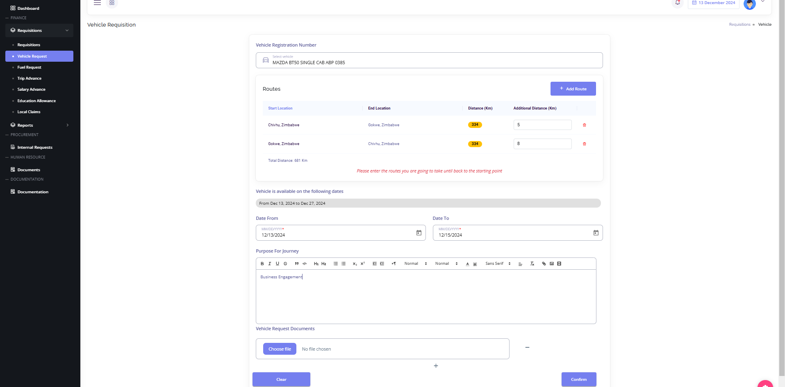
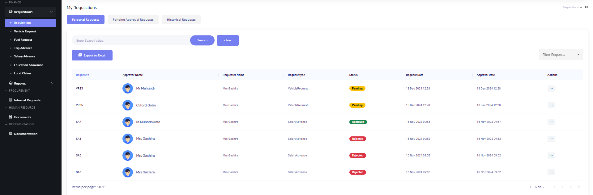
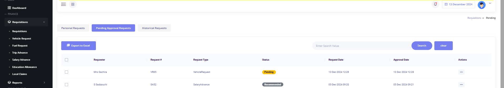
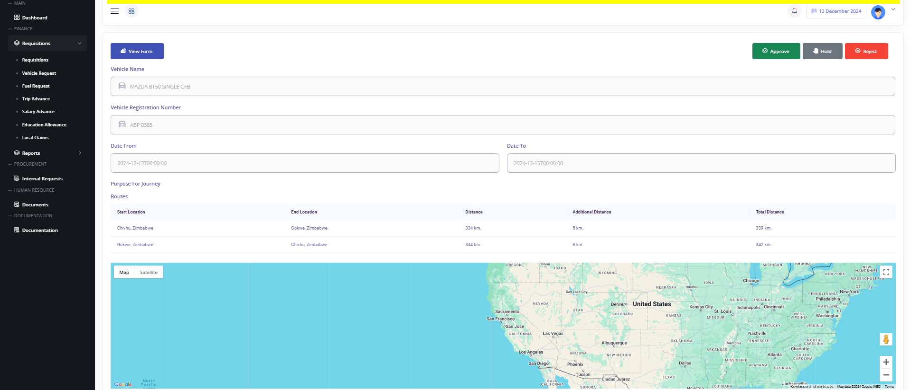
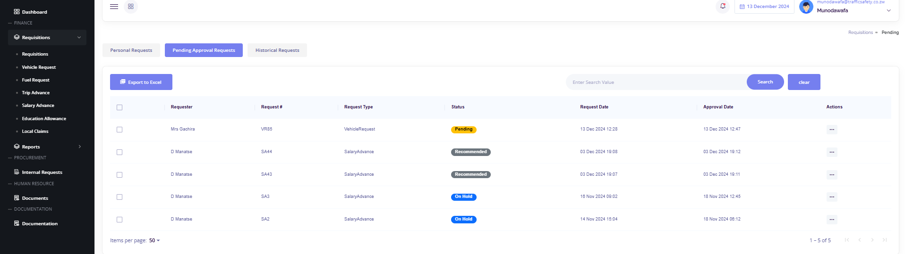
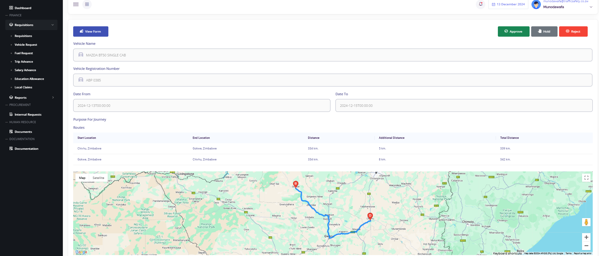
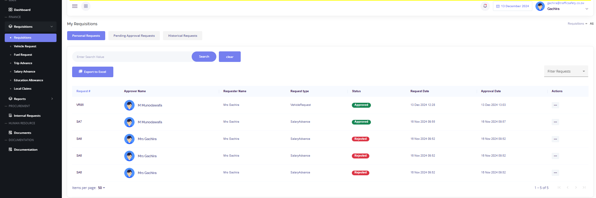

These are the scenarios where requisitions are made by directors, managing director or when the managing director is not available for approvals.

---

## Scenario 1: The normal flow where one of the directors make a request  

A normal request by one of the directors enumerates these steps:
- **STEP 1**: Director makes a request
- **STEP 2**: Any Director other than the requester recommends
- **STEP 3**: MD Approves

### STEP 1: Director Legal makes a vehicle request

The image below shows a vehicle request that is being crafted by Mrs Gachira. After supplying all these details, user clicks confirm and the request will be saved.

The image below is a depiction of Gachira's pending requests.

From these personal requests, it can be seen that Mahundi and Gobo, who are directors have had this request recommended to them.

### STEP 2: Director of Finance recommends the request.
After a request has been made by Gachira, Gobo and Mahundi will have this request devised in their pending requisitions awaiting approval. The image below shows this vehicle request on Gobo's pending approvals.

User navigates to their pending approval requests to check this vehicle requests. The image above shows this pending requests. To undertake any action, user clicks actions and will have the image below depicted to them where they can approve, hold or reject this request. To approve this use rsimply clicks the approve button. By so doing, the request is recommended to the managing director that is the final approver.

### STEP 3: Managing Director Approves
Now that the request has been recommended to the MD by the director of finance, MD logs in and navigates to the pending approval requests to action on this vehicle request.
MD checks their pending approvals as shown below:

MD clicks on the actions sections, this click will allow the MD to view the details of this vehicle request. After viewing details, the MD will have the image below below shown to them.

This allows the MD to click on any of the available options which are:
- **Approve**
- **Hold**
- **Reject**

In this case the MD is approcing so they click on **Approve** and this request will change its status from pending to approved. This will simply accentuate the fact that Director Legal will be in a position to get this vehicle she requested.
The image below simply shows the status change of Gachira's request when logged in

Director Legal can also see the steps this request would have gone throught by simply clicking actions from the image above above and they will an option to view details of the request as well as checking the ifespan of their request.

---

## Videos

- Check the [Directors' Request](https://www.loom.com/share/bb359d3f228d4df284806a1dec20ada0?sid=febf0327-e058-4d37-a2f0-f4ec81a169df)

- Also check the [MD's Request](https://www.loom.com/share/a510bdad8c854dc0b84197f61e81f6d2?sid=df8e1c5e-74c2-46d8-8125-9baf993f20c8)
