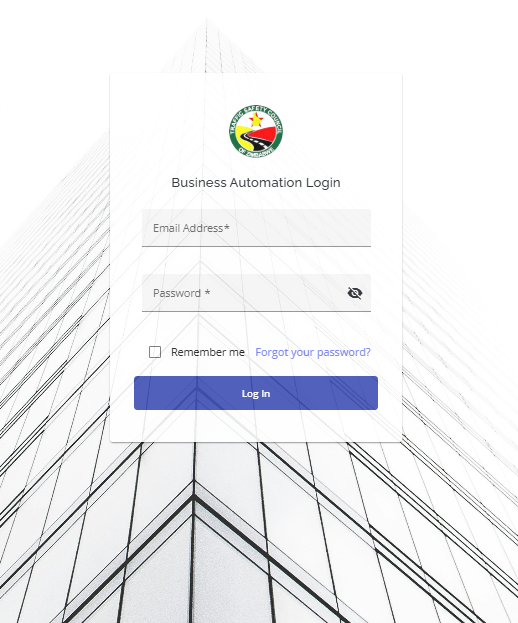
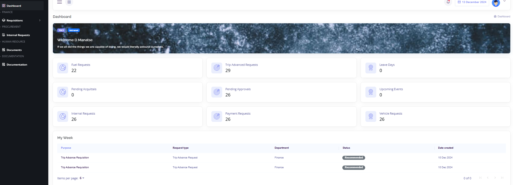
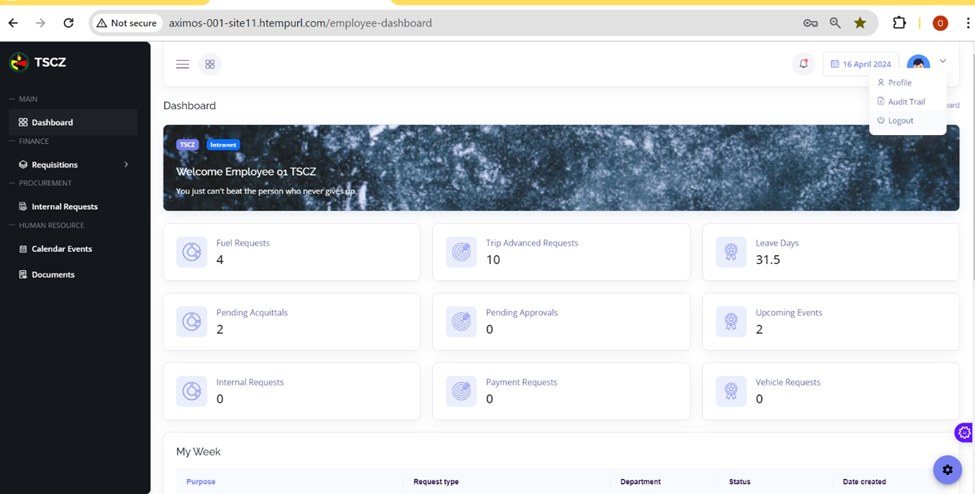

Welcome to the **TSCZ Business Automation System**, your all-in-one platform for your business processes and requisitions. To be in position to log in seamlessly, users must first  **have their accoounts created by the system Admin** and they are required to **confirm their accounts via email**. This document will guide you through the process of doing requisitions, checking profiles and tracking requests lifecycles.

## Prerequisites  

1. An account created by the System Administrator.  
2. Confirmed account.  
3. Email address and password for the confirmed account.  

---

## Step 1: Log In  

1. **Visit the Log In Page**  
   Click [here](https://manera.trafficsafety.co.zw:8093/authentication/login) to access the TSCZ plaftform. 
   This will take the user to the log in page as shown below. 
    

   For those who would love to save their passwords, they simply click the **Remember me** check in box. Concurrently, those that would have forgotten heir passwords, they simply reset their password by a click on the **Forgot your password?** section.  
                   

2. **Submit Log In Information**  
   User simply inputs their email address and password they would used when confirming an account created by the system admin.
   When the Log In button is clicked, user lands at the dashboard shown in step 2.

---

## Step 2: Dashboard  

After logging in, user lands on the dashboard. This is where they can see the notification section, finance, administration and procurement sections as well as summaries of requisitions, approvals and their leave days

User also scrolls up and down on the dashboard. They can see different features like where they can log out their account(top right corner)
The image below shows what the dashboard will look like when user logs in to the automation system.

## Step 3: Log Out 
For any user to log out of their intranet account, they simply visit their profile section on the top right corner of their dashboard.

There are 3 options that the user is devised with when the profile icon is selected. User selects the third option which is the log out option. When clicked the log out field, user will be logged out and will be taken to the log in page, a clear indication that they have successfully logged out of their account.
