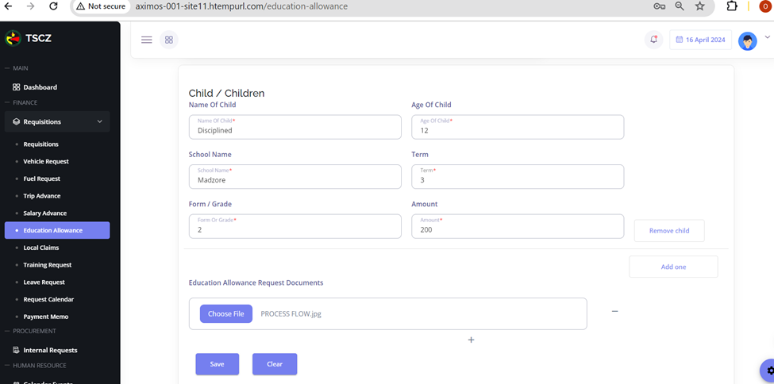

This requisitions guide offers users detailed guidance on the stages incurred when user wants to do requisitions (fuel request, vehicle request, trip advance request, salary advance etc).

## Vehicle Request

When user wants to make a vehicle requisition, they navigate to their Requisitions section after logging in. This will prompt a list of request types user would be able to do. For vehicle request, user simply cicks onVehicle Request to start requesting for a vehicle.

User fills in the fields : vehicle registration number, route and the date as shown. This process involves selecting vehicles from the vehicle's list and adding the route for which they will be undertaking.
Check the image below on the guidance for adding a route. click the **Add Route** plus sign to land to a page where you can add your route.

Let’s assume that the user wants to request the vehicle for a business trip from Masvingo to Harare and back to Masvingo after the trip so it’s a roundtrip
User types in Masvingo and google maps automatically detects where Masvingo is located for them, and if specifically a certain area in Masvingo to say user wants to go to Flamboyant Hotel in Masvingo.
After selecting Masvingo they can as well choose their destination on the other section and click add route.
If it’s a rounded trip user ticks in the rounded trip section.
User also types in the added distance that they may incur during the trip on the additional field section.
After all these steps user will click save trip routes button and their route is automatically calculated.
User will be send back to their vehicle request main page where they will scroll down to continue with adding the date other details needed.
User clicks the date icon on the from and to fields to share the dates they will be attending the trip.
Requester is devised with a text section where they can give a description on the details of the trip.

After that, user will have to choose a file, as a supporting document for their vehicle request (not mandatory, mandatory requests have this requirement highlighted).
User clicks choose file and they will be taken to their file manager application in their computer.
User selects the file and clicks confirm on the bottom right corner of the vehicle request page.
Upon clicking the confirm button, user will have the success massage popping out on their screen.
Thus how the user creates a vehicle requests and they will have it under my requisition as a pending request for it will be waiting to be approved.
The status of this request keeps on changing at each and every approval stage.

To view details of the request, user clicks on request and filter for vehicle request.
User clicks on view details under the actions section of the vehicle request
The image below will be devised to the users screen when they will on View form to see the requisition form of this vehicle request.

To also check the lifespan of the request, user clicks on view lifespan to check this out.
User clicks view lifespan to have this lifespan shown below devised to them.

Once this request has been recommended or actioned on in any of the approval stages, the lifespan of it will start showing.
Conclusively, this request is recommended to Finance Manager for approval and once approved the requester will get to collect the vehicle for the route.

## Video
[Vehicle Request](https://www.loom.com/share/b9f9520b281f445baca2e214c27d426a?sid=cbfbc7df-afc8-4898-ace9-07896db77424)

## Fuel Request
After logging in to the dashboard and selecting the fuel request field, user fills in the fields that follow.
This includes selecting the Vehicle they are requesting fuel for, adding the distance to be covered by the fuel they are requesting and adding the route as well.

When adding route, user selects their start location and end location. 
After adding locations of start and end route, click **Add Route**.
After adding the route the distance will be recorded and if any additional distance in Km user will manually type that in the additional distance field.
User now clicks on  **Save Trip Routes**, return to the initial form so that they continue filling in the details on other remaining fields.
These remaining fields are the date sections, purpose for the fuel requisition and the fuel type.
After selecting the above accordingly, user will the uploads a file(pdf, image, excel, word, etc) that acts as a supporting document for the requisition
Shown below is how user selects the file and uploads it when doing the request.

After choosing the file, user clicks **Confirm** to send the requests.
However, during the coyrse of doing this request user might decide to not continue with this request type and simply clicks the Clear button on their bottom left side.
On the other hand, after clicking confirm user would have completed the requisition process.
This is a confirmation that the request was successfully created and sent to the finance team for previous advance clearance and approval.
User can also check request details.

To check the lifespan of a request that has been recommended or rejected, user checks their lifespan via actions and the details will be shown accordingly:

## Video
[Fuel Request](https://www.loom.com/share/72c104cefed04aaa8c64620c373674fb?sid=9e0b1c30-5ab2-4727-9e5b-b0cf2a157712)
## Trip Advance
- Employee logs in to their TSCZ account.
- When they land to their dashboard, they select the requisitions section where they will have  a list of requisitions they can make.
- User selects Trip Advance and have Fig 3.2.1 devised to them where they fill in the needed fields to complete a trip advance requisition

- User adds their route as is below
- User adds distance and the additional distance in kilometers

- If the trip is a rounded one they tick on the rounded trip and save trip route.
- User continues to fill in the details section. This encompasses the distance and stating whether the trip advance will require a vehicle, air, train or bus.
- User clicks next to supply details on the trip expenses section.

- Breakfast, lunch and accommodation are already set expenses in accord to the organization standards. User simply inputs the details on quantities of each and every expenses and they will be calculated for them
- For expenses that are not there on expenses list, user adds those as supplementary expenses.
- To add this, click the plus icon and a field to add this expense is shown.

- User will then select the type of expense as well as stating the  amount for each and every expense selected
- On the additional expenses, user states the expenses and the amount that it will take , if there are no additional expenses user clicks next to fill in the details on vehicle requisition

- When requesting for a vehicle, user will have to upload a file with the details that user is requesting for a particular vehicle.
- After supplying vehicle requisition details user confirms these details so that they complete the final stage of this requisition, fuel requisition.

## Approval Flow
- That is how a trip advance requisition is made. When successfully created the request will be send to the supervisor to check the requisition and recommends it to the finance manager, director of finance and the managing director for final approval.
- Finance manager/supervisor logs in to their account to check pending approval requests

- Supervisor clicks on the three dots under actions to view details of the requisitions pending for approveal.
- These requests can be filtered by request type by simply selecting the filter requests button.
- When the supervisor has viewed the details of a request, they will have an option to Approve, Hold or Reject the request.

- An approved request will be recommended to the Director of finance.
- DAF will then log in to check their pending approval requests.

- To approve this, DAF simply views this request and approves.

- Now that the Director of Finance has approved this request, the recommendation will go to the final approver, the MD.
- So MD simply logs in and navigates to their pending approvals 

- To approve the trip advance, MD views the trip advance request.

- After clicking Approve, a success message will be devised to the MD's screen

- If MD checks the status of this request, it would have changed from recommdended to Approved.

- User can also confirm this under their personal requests

## Videos
[Trip Advance Request](https://www.loom.com/share/8fe0b67fa9d54a3fb2380c0ca1b7f496?sid=70f3f68a-329a-4e23-ba83-2c341ddfe7fb)

[Trip Advance Acquittal Request](https://www.loom.com/share/8fe0b67fa9d54a3fb2380c0ca1b7f496?sid=cdde5c04-d194-4b85-a44d-d31267bb442a)

[Trip Advance Acquittal](https://www.loom.com/share/4f79af34847b4a17a75504b07d272468?sid=7468a6b1-8eac-4f64-81c5-b15734067a2c)

## Salary Advance
Firstly, user/employee logs in to their account.
- When the user logs in, they land at their dashboard where they will start to make this requisition. 
- User expands the requisitions section.
- This will devise the user with a list of requisition they can make
- User will click on Salary Advance to do this request type

- After selecting Salary Advance, the user will be in a position to see the section where they can fill in to complete the request.
- The areas  to be filled in are the amount, purpose of the salary advance as well the document supporting this action.

- User also uploads their supporting file(manadatory) as pdf, png or any document that has got supporting details for this requisition to succeed.
- After filling in the sections as is showcased, user clicks save.
- A success message will pop up on the employees’ screen.
- They will also have an option to click the Go back to requests button to make other requisitions.
- This is how an employee  makes a salary advance request.
- They can also check the status of their request by simply visiting their requisitions page.
- They can also filter the requests to specifically see a number of request type they would have made.
- A click on the three dots under the actions section will allow the user to view details as well as seeing the lifespan of the request.

- User then sees their Salary Advance requests on the list of their personal requests
- This is an indication that this request has been submitted to the Human Resources for recommendation and later to the finance manager, director and likewise the managing director.

## Explainer Video
- Refer to this [Salary Advance](https://www.loom.com/share/108bc55511f04b398cc18391917894a2?sid=9fef8d36-9344-4add-a020-e509c5d4abe5) video.

## Education Allowance
- User selects Education Allowance under requisitions lists.
- User lands at a page where they get to fill in the details about the child/children they would want the education allowance for.
- These details are the name of the child, age, school name and the amount for thet term the requisition is being done for.
- User also chooses a file in word, pdf or png form as a supporting document.
- This could be the quotation from the child's school or any other details that may be of usefulness when doing this requisition.

- If user wants to add a child for the education allowance, they click **Add** icon.
- They will have a page devised to them so that they supply details for the other child.
- To remove a child user simply click **Remove Child**.

- User fills in the details for the other child as deicted.

- After the user has successfully provided the details needed in all these fields, they click save button to finish the requisition process.
- This gives the user a success message and they would have done an education allowance type of request.
- The request will be send to HR , finance and the managing director for approval.
- User can see their requests by a click on their requisitions section.

## Explainer Video
[Education  Allowance](https://www.loom.com/share/c439c98d8b754897a1631e29e446977d?sid=da820684-3e94-446b-ace4-84bfb2ec6da8)

[Education Allowance](https://www.loom.com/share/c439c98d8b754897a1631e29e446977d?sid=506d5eb5-af88-4e1a-a798-60b40b2bab40)

## Local Claims
- To do the local claims type of requests, user chooses it under requisition. 

- For this type of request, user will request within the parameters of the budget and balance amounts shown on their screen.
- User states the amount, date, the start time and end time as well as the number of hours which will be calculated given the user has given their start and end time durations.
- Finally, user selects the file they want to supply as a supporting document for this local claim requisition.

- User clicks save and have the success message devised to them
- If user visits their requisitions section to check this request they will have it shown as is below.
- User can also filter their requests in order for them to see and check on the status of specific requests.

