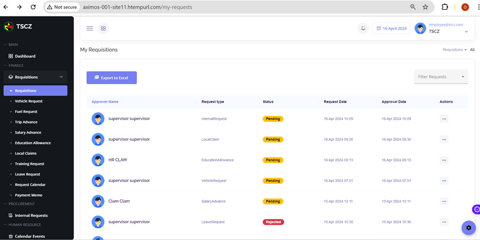
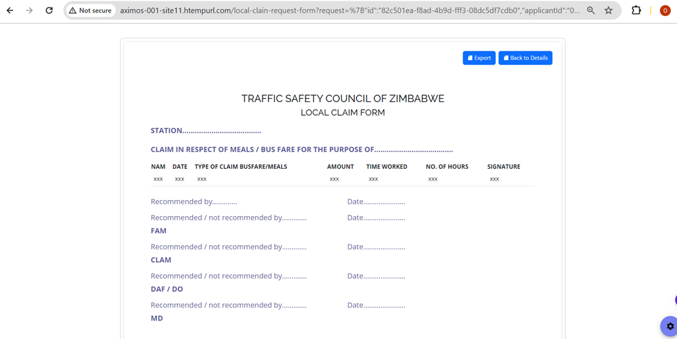

This requisitions guide offers users detailed guidance on the stages incurred when user wants to do requisitions (fuel request, vehicle request, trip advance request, salary advance etc).

## Requisitions Explained

When user wants to make a requisition, they click the Requisitions field shown on their dashboard.

User will now have a list of requisitions they will be in a position to do. These include Vehicle request, Fuel request, Trip advance, Salary advance and all other requests which will be available. The **Request Types** section of this documentation shares the steps on how to do these requisitions.
Below is a depiction of what users see when visited the requisirions section, thus requisitions done before and those awaiting approval.

The image above also has a status section where the user can also see whether the requests was approved, rejected or it’s still pending.
From the image above, it can be seen that there is an Actions section. It is from the actions sections that the user can simply view details of the request as well as seeing the lifespan of the request. To view details of the user clicks on the three dots of the any request under the actions section. The image below will be devised on the user’s screen.

User clicks view details so that they see the details of the request type. When user has clicked the view details section, they will see what's shown below.

When view details is clicked, user will be able to see the amount requested for, the date , the type of request and attachments if any. In order for the user to view the requisition form for each and every request, they simply click on **View form** from above action to view the request form.

- That is how the user can view details of a request as well as viewing the requisition form for each and every request type.
- In order for the user to view the lifespan of the request, they simply click on view lifespan on actions. 
- User clicks view lifespan so that they see they stages that the request has gone through
- Given the request is still pending for approval or has had been to rejection, such information will be seen through viewing the lifespan of a request:

Shown bove are the stages that the request has encountered from the first step up until the final approval stage thus it’s lifespan.